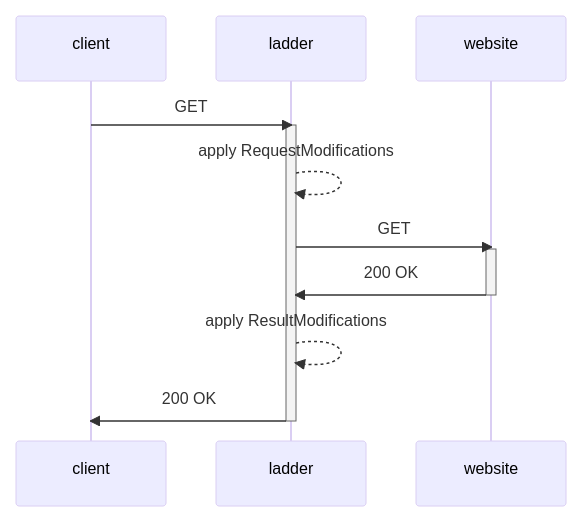

<!--
N.B.: This README was automatically generated by <https://github.com/YunoHost/apps/tree/master/tools/readme_generator>
It shall NOT be edited by hand.
-->

# Ladder for YunoHost

[](https://dash.yunohost.org/appci/app/ladder)  

[](https://install-app.yunohost.org/?app=ladder)

*[Read this README is other languages.](./ALL_README.md)*

> *This package allows you to install Ladder quickly and simply on a YunoHost server.*  
> *If you don't have YunoHost, please consult [the guide](https://yunohost.org/install) to learn how to install it.*

## Overview

Freedom of information is an essential pillar of democracy and informed decision-making. While media organizations have legitimate financial interests, it is crucial to strike a balance between profitability and the public's right to access information. The proliferation of paywalls raises concerns about the erosion of this fundamental freedom, and it is imperative for society to find innovative ways to preserve access to vital information without compromising the sustainability of journalism. In a world where knowledge should be shared and not commodified, paywalls should be critically examined to ensure that they do not undermine the principles of an open and informed society.

Some sites do not expose their content to search engines, which means that the proxy cannot access the content. A future version will try to fetch the content from Google Cache.

Certain sites may display missing images or encounter formatting issues. This can be attributed to the site's reliance on JavaScript or CSS for image and resource loading, which presents a limitation when accessed through this proxy. If you prefer a full experience, please consider buying a subscription for the site.

**Shipped version:** 0.0.21~ynh2

## Screenshots



## Documentation and resources

- Upstream app code repository: <https://github.com/everywall/ladder>
- YunoHost Store: <https://apps.yunohost.org/app/ladder>
- Report a bug: <https://github.com/YunoHost-Apps/ladder_ynh/issues>

## Developer info

Please send your pull request to the [`testing` branch](https://github.com/YunoHost-Apps/ladder_ynh/tree/testing).

To try the `testing` branch, please proceed like that:

```bash
sudo yunohost app install https://github.com/YunoHost-Apps/ladder_ynh/tree/testing --debug
or
sudo yunohost app upgrade ladder -u https://github.com/YunoHost-Apps/ladder_ynh/tree/testing --debug
```

**More info regarding app packaging:** <https://yunohost.org/packaging_apps>
